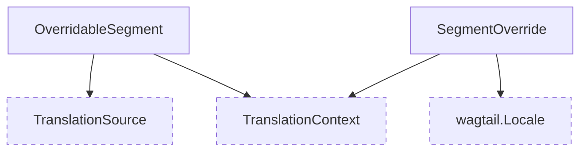

# Overridable segments models

These models are responsible for storing details about overridable segments in a translation source and storing the overridden data as well.

Overriding segments within an object allows non-text data to be modified for each locale.

::: wagtail_localize.models
    selection:
        members:
            - SegmentOverride
            - OverridableSegment
        filters:
            - "!^save$"
