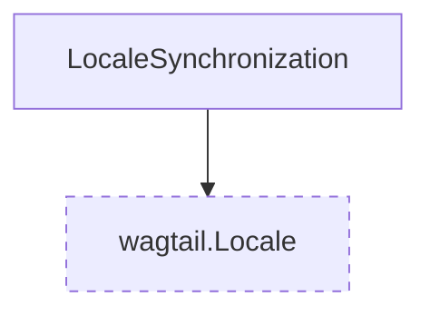

# Settings models

These models are responsible for storing settings that are configured by a user.

::: wagtail_localize.models
    selection:
        members:
            - LocaleSynchronization
        filters:
            - "!^save$"
