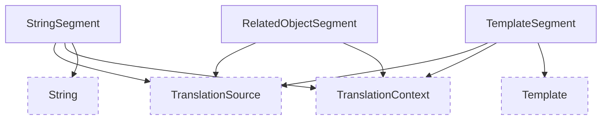

# Translatable segments models

These models are responsible for storing details about translatable segments within a translation source.

::: wagtail_localize.models
    selection:
        members:
            - SegmentOverride
            - StringSegment
            - TemplateSegment
            - RelatedObjectSegment
            - OverridableSegment
        filters:
            - "!^save$"
