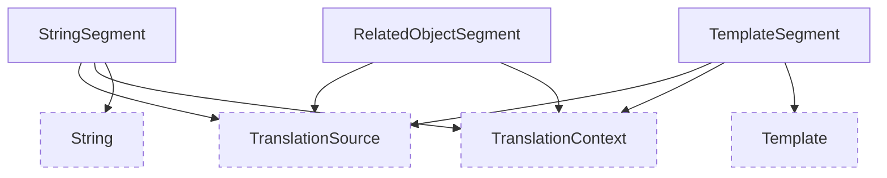

# Translatable segments models

These models are responsible for storing details about translatable segments within a translation source.

```mermaid
graph TD


A[StringSegment] --> F[TranslationSource]
B[TemplateSegment] --> F
C[RelatedObjectSegment] --> F
A[StringSegment] --> G[TranslationContext]
B[TemplateSegment] --> G
C[RelatedObjectSegment] --> G
A[StringSegment] --> H[String]
B[TemplateSegment] --> I[Template]

style F stroke-dasharray: 5 5
style G stroke-dasharray: 5 5
style H stroke-dasharray: 5 5
style I stroke-dasharray: 5 5
```

::: wagtail_localize.models.SegmentOverride
    options:
      show_root_heading: true

::: wagtail_localize.models.StringSegment
    options:
      show_root_heading: true

::: wagtail_localize.models.TemplateSegment
    options:
      show_root_heading: true

::: wagtail_localize.models.RelatedObjectSegment
    options:
      show_root_heading: true

::: wagtail_localize.models.OverridableSegment
    options:
      show_root_heading: true
