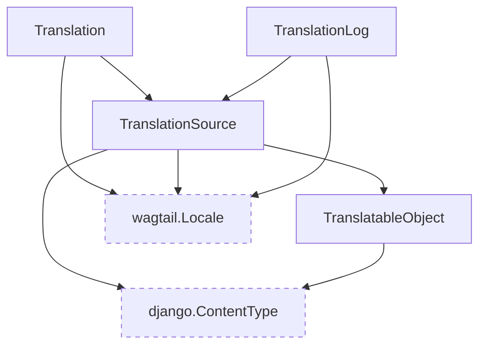

# Translation management models

These models are responsible for managing the translation of objects.

::: wagtail_localize.models
    selection:
        members:
            - TranslatableObject
            - TranslationSource
            - Translation
            - TranslationLog
        filters:
            - "!^save$"
