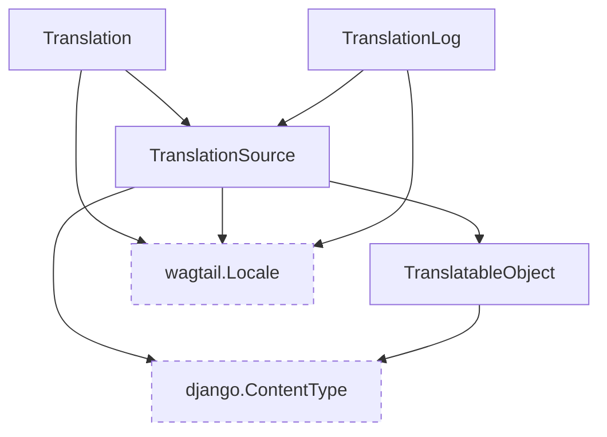

# Translation management models

These models are responsible for managing the translation of objects.

```mermaid
graph TD
A[TranslationSource] --> B[TranslatableObject]
C[Translation] --> A
D[TranslationLog] --> A
C --> E[wagtail.Locale]
A --> E
D --> E
A --> F[django.ContentType]
B --> F

style E stroke-dasharray: 5 5
style F stroke-dasharray: 5 5
```

::: wagtail_localize.models.TranslatableObject

::: wagtail_localize.models.TranslationSource

::: wagtail_localize.models.Translation

::: wagtail_localize.models.TranslationLog
