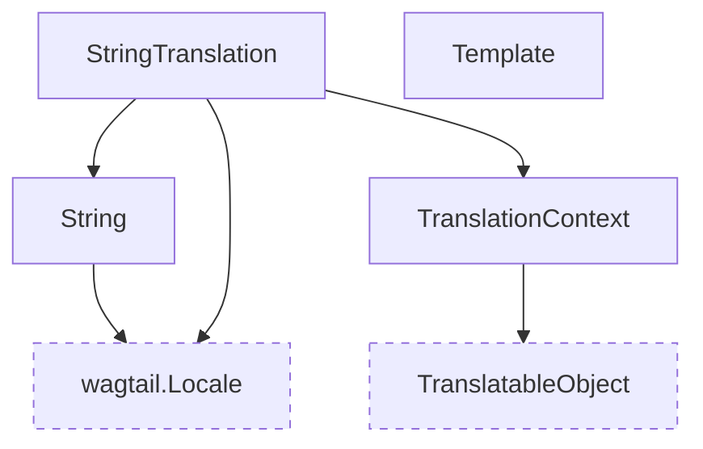

# Translation memory models

These models are responsible for storing individual source strings and their translations.

::: wagtail_localize.models
    selection:
        members:
            - String
            - TranslationContext
            - Template
            - StringTranslation
        filters:
            - "!^save$"
