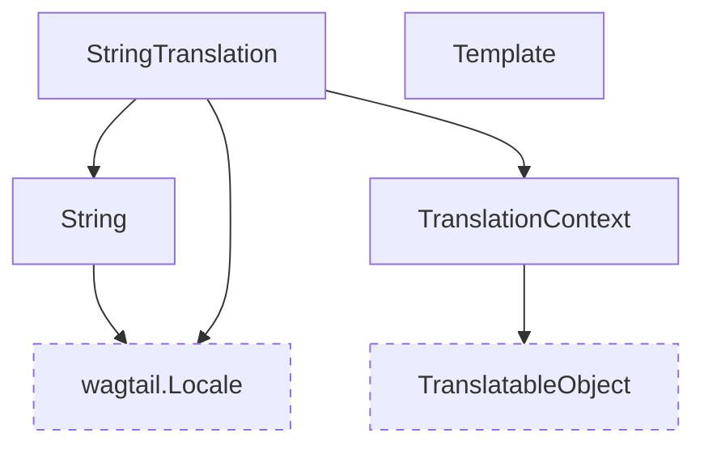

# Translation memory models

These models are responsible for storing individual source strings and their translations.

```mermaid
graph TD
A[String] --> B[wagtail.Locale]
C[StringTranslation] --> B
C --> A
C --> D[TranslationContext]
D --> E[TranslatableObject]
F[Template]

style B stroke-dasharray: 5 5
style E stroke-dasharray: 5 5
```

::: wagtail_localize.models.String
    options:
      show_root_heading: true
      filters:
        - "!^save$"

::: wagtail_localize.models.TranslationContext
    options:
      show_root_heading: true
      filters:
        - "!^save$"

::: wagtail_localize.models.Template
    options:
      show_root_heading: true
      filters:
        - "!^save$"

::: wagtail_localize.models.StringTranslation
    options:
      show_root_heading: true
      filters:
        - "!^save$"
